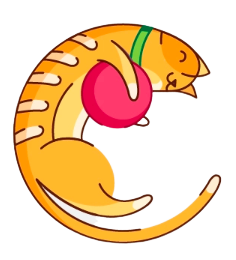

# CATalist

We use science to find your perfect match!

CATalist is the first service within the online pet adoption to use a scientific approach to matching highly compatible cats and hoomans. Catalist's matching is based on using our proprietary AI to match cats and humans based on features of compatibility found in thousands of successful adoptions.

## Getting Started

Register as a new user, choose your personality type, log in, view your cat matches, and adopt a new friend!

## Features

* Registration
* User Login/Profile Update
* Admin Dashboard 
* Admin Create, Update & Delete Functionality
* Cat Index Page
* Profile View
* Dynamic NavBar
* Dynamic Landing Page
* MySQL Data Persistence

## Work-in-Progress Features

* Functional Adopt Button
* Fix Update Profile Function for Preferences
* Style Create Page
* Locking down the Dashboard

## Built With

* [Java](https://www.java.com/en/) - Java
* [Maven](https://maven.apache.org/) - Dependency Management
* [MySQL](http://mysql.com/) - MySQL
* [Skeleton](http://getskeleton.com/) - Skeleton
* [RoboHash](https://robohash.org/) - RoboHash

## Authors

See the list of [contributors](https://github.com/catlister/Catlister/graphs/contributors) who participated in this project.

## Acknowledgments

* Tuxedo and Bow-Tie
